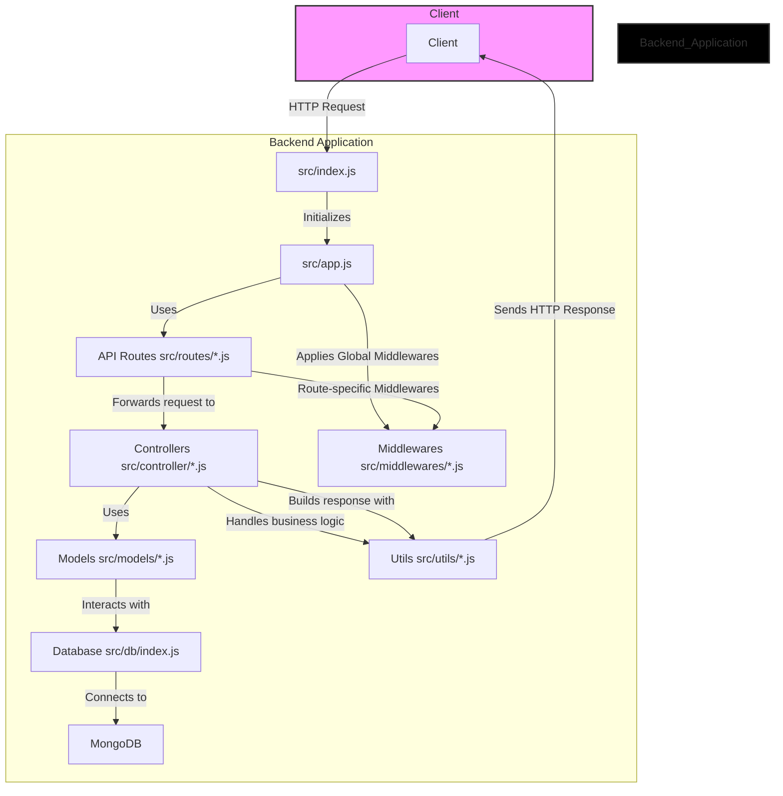

```mermaid
graph TD
    subgraph "Client"
        A[Client]
    end

    subgraph "Backend Application"
        B[src/index.js]
        C[src/app.js]
        D[API Routes src/routes/*.js]
        E[Controllers src/controller/*.js]
        F[Models src/models/*.js]
        G[Database src/db/index.js]
        H[MongoDB]
        I[Middlewares src/middlewares/*.js]
        J[Utils src/utils/*.js]
    end

    A -- HTTP Request --> B;
    B -- Initializes --> C;
    C -- Uses --> D;
    C -- Applies Global Middlewares --> I;
    D -- Route-specific Middlewares --> I;
    D -- Forwards request to --> E;
    E -- Handles business logic --> J;
    E -- Uses --> F;
    F -- Interacts with --> G;
    G -- Connects to --> H;
    E -- Builds response with --> J;
    J -- Sends HTTP Response --> A;

    style Client fill:#f9f,stroke:#333,stroke-width:2px
    style Backend_Application fill:#000,stroke:#333,stroke-width:2px
```
